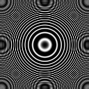

## Spatial Processing

This page describes demo software programs to help illustrate a few principles of spatial processing that are important to neuroimaging.

##### Installation

 - [A pre-compiled version is also available](https://github.com/neurolabusc/spatial-processing/releases)
 - The source code is available which can be used to compile the software for macOS, Windows and Linux from [https://github.com/neurolabusc/Cancel](https://github.com/neurolabusc/spatial-processing)

##### Spatial Smoothing

   
fMRI data is typically smoothed before we compute statistics. By blurring the data, we can eliminate high frequency noise, and ensure that our data is relatively normaly distributed. In neuroimaging, we classically apply a 3D gaussian smooth, where we adjust the Full Width Half Maximum. My demo software allows you to interactively apply a gaussian smooth to a 2D bitmap image. You can interactively adjust the FWHM (defined in pixels). The program initially displays a white rectangle on a black background, but you can load any image you wish. The source image is shown in the upper left, and the smoothed output is shown in the upper right corner. The lower images show image intensity histograms along the middle line of the source and smoothed images. Note that with a large smoothing kernel you can not distinguish the broad-low contrast left side of the rectangle from the narrow high contrast right side. This demonstrates why it is difficult to determine if smoothed fMRI activation shows recruitment of a larger area of cortex or whether it reflects more activation within the same region of cortex.

The pull-down menu allows you to choose different image processing functions: blurring, fisheye effect, intensity gradient, gaussian noise, and median filtering. For most of these functions, adjusting the number shown on the upper left of the window influences adjusts how extreme these functions are. Most of these functions allow you to adjust the number value to influence the magnitude of the filters influence – note that if you set the number to 0 the transformed image will always be the same as the source image (this allows you to use the ‘Save’ button to save the source image.

The “Open BMP” button allows you to change the source image (you can choose BMP,PNG or JPG format images). The “Save” button stores the transformed image.

The pulldown menu allows you to select a few image processing functions:

 - Blur: applies 2D gaussian blur. Adjusting the number changes the full width half maximum (in pixels). Therefore, an image blurred with 20 looks fuzzier than one with a setting of 2.
 - Fisheye: applies a fisheye lens. Adjusting the number changes the focal length (with values 0..100). Values below 50 expand the central region, values near 50 have little effect, and values larger than 50 compress the inner region.
 - Perspective: shrinks top of the image, making a 2D image appear as if it was seen at an angle. Adjusting the number changes the degree of warping (0=none, 100=extreme).
 - Gradient: Makes the bottom of the image darker. Adjusting the number changes the rate of darkening from top to bottom. At values near 0 everything is dark, values near 50 show linear darkening from top to bottom, and value near 100 show very little darkening.
 - Gaussian noise: Makes your images appear grainy. Adjusting the number changes the degree of noise (0=none, 100=extreme).
 - Median filter: Applies 2D median filter – load a noisy image to see this effect (e.g. press ‘Open BMP’ and select the included T1noise.png image). You can compare this filter to the gaussian blur. Adjusting the number has no effect on this function (though if this is set to zero the filter will not be applied). The included ‘T1noise.png’ is a nice sample image for testing this function.
 - Fisheye filter: Warps image. Adjusting the number changes the distortion – numbers near 50 have little effect, numbers near 1 massively enlarge the image center and numbers near 100 massively shrink the image center.

Pressing the Rotate button allows you to rotate the source image. You can adjust the number to choose the amount of rotation (in degrees). The included ‘rotateT1.png’ image is a nice sample image for this (it includes a wide border, which helps for successive rotations where only information within a circular radius around the center will be preserved). You will be asked to specify how many times the image should be consecutively rotated and the interpolation filter to be applied (0= nearest neighbor, 1=linear, 2=sinc). This example demonstrates that resampling causes cumulative errors. For example, applying a 10-degree filter 9 times will lead to a more distorted image than a single 90-degree rotation. Working with this you will see that the nearest neighbor interpolation leads to blocky images, and consecutive iterations lead to strange artifacts (a swirling effect based on distance from center). On the other hand, multiple linear interpolations lead to progressive loss of high frequencies (the image appears blurred). The sinc filter tends to look much better than the other filters (though it is much slower, particularly in my simple implementation), also with this windowed Lanczos variant of the sinc filter one can often see subtle ringing artifacts near sharp edges.

This software also includes a button labelled ‘Open 2 BMPs’ that allows you to blend two bitmap images (they must have the same dimensions). For example, press this button and open the ‘fmri1.png’ and ‘fmri2.png’ images that come with the software. You will be asked to choose a function to apply, with the resulting image appearing on the left side of the program (as your new input image):

 - Mean: average of two images.
 - Difference: first image minus second image.
 - Absolute difference: regions where two images differ, regardless of which is brighter or darker.
 - Variance: difference squared image.

##### Spatial Transformations

During MRI analysis, we often coregister our images – i.e. we will warp different images to look similar to each other. In particular, we will need to conduct two types of coregistration – motion correct (where the series of fMRI images are aligned to adjust for the participant moving their head during the scanning) and normalization (where we align images from different people to allow group inferences to be made). Regardless of whether you are using SPM, FSL’s FLIRT or another tool, much of the coregistration is done by applying a linear spatial transformation matrix to warp the images. This transformation matrix can encode rotations, translations, zooms (streching or shrinking) and shear transforms. My simple demo allows you to see how a single matrix can encode multiple linear transformations. Note the sample software allows you to manipulate a 2D image (using a 3×3 matrix), while FLIRT manipulates 3D images (using a 4×4 matrix), but the prinicples are identical. The demo also allows you to see the influence of nearest neighbor, linear and sinc interpolations (FSL uses a windowed sinc filter, while SPM uses higher-order b-splines for similar high-quality filtering).

##### Aliasing

The transform allows us to change the size of our image, in the sample software this is referred to as the 'Zoom' - where you can make an image larger or smaller. Note that if you make an image smaller, you may see some aliasing. This is illustrated in the images below. The large image on the left is the source image. The second image shows the influence of shrinking the image to half of its original size in each dimension (a Zoom of 0.5 in the X and Y directions). Note that it exhibits strong artifacts: the original image has higher frequencies than can be represented in the smaller image, and these appear as lower frequencies. This is known as aliasing, and is the same reason car wheels can appear to spin backwards on TV, or why helicopter rotor blades can appear motionless in [YouTube videos](https://www.youtube.com/watch?v=R-IVw8OKjvQ). You can experiment with 1D aliasing with the [Temporal Filtering](https://github.com/neurolabusc/biquad-filter) demos. The final image shows the image when it is reduced using an [anti-aliasing filter](https://nbviewer.jupyter.org/urls/dl.dropbox.com/s/s0nw827nc4kcnaa/Aliasing.ipynb). The  [Matlab web pages](https://blogs.mathworks.com/steve/2017/01/16/aliasing-and-image-resizing-part-3/) include a nice description of aliasing in images, as well as citing the seminal mehtod by Dale Schumacher (1994, 'General Filtered Image Rescaling') that was used to create the anti-aliased image image.

